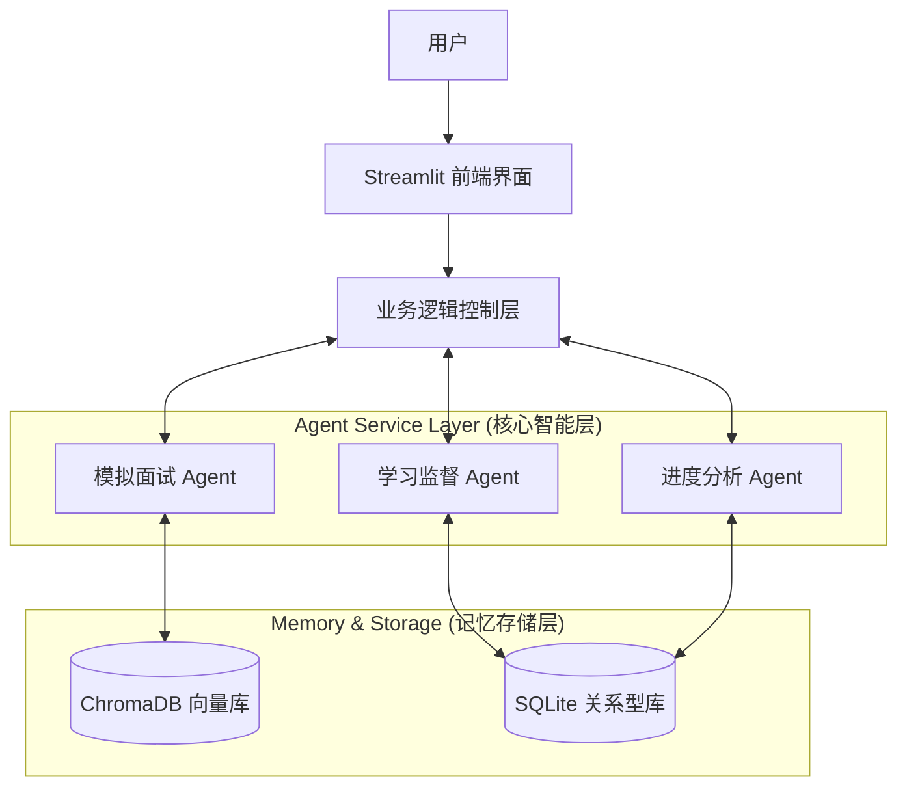

# AI 面试辅助学习助手 - 系统设计文档

## 1. 系统架构 (MVP 阶段)

采用分层架构，以 Streamlit 作为前端交互层，底层通过 Python 逻辑层协调各 Agent 与数据库的交互。



## 2. 核心 Agent 设计

### A. 学习监督 Agent (Supervisor)
- **职责**: 类似于"班主任"。
- **输入**: 用户目标岗位、剩余天数、历史完成度。
- **输出**: 每日 To-Do List（例如："复习 TCP/IP 三次握手", "刷两道 LeetCode 动态规划"）。
- **交互**: 每天首次登录时主动打招呼，检查昨日进度。

### B. 模拟面试 Agent (Interviewer)
- **职责**: 类似于"面试官"。
- **输入**: 面试主题（如：计算机网络）、难度等级。
- **运行机制**: 
    1. 从向量库检索或生成相关题目。
    2. 提问 -> 等待用户输入 -> **深度点评**(亮点、不足、参考答案) -> 下一题。
    3. 追问机制：用户回答不完整时进行追问。

### C. 进度分析 Agent (Analyst)
- **职责**: 类似于"教务处"。
- **触发**: 每周或用户主动请求。
- **分析**: 基于历史面试评分、学习打卡率。
- **输出**: 雷达图数据（基础知识、算法能力、项目经验、表达逻辑），并动态调整后续计划难度。

## 3. 数据库设计 (SQLite MVP)

### User Check-ins (打卡记录)
| 字段 | 类型 | 说明 |
| :--- | :--- | :--- |
| id | int | 主键 |
| date | date | 日期 |
| plan_content | json | 当日计划内容 |
| status | string | 完成/未完成 |
| reflection | text | 用户每日总结 |

### Interview Logs (面试记录)
| 字段 | 类型 | 说明 |
| :--- | :--- | :--- |
| id | int | 主键 |
| topic | string | 主题 |
| q_a_history | json | 问答对 list |
| score | float | 总体评分 |
| feedback | text | AI 综合点评 |

## 4. 目录结构规划

```
interview_assistant/
├── app/                  # Streamlit 前端页面
│   ├── main.py           # 入口文件
│   ├── pages/            # 各功能页
│   └── components/       # UI 组件
├── core/                 # 核心业务逻辑
│   ├── agents/           # Agent 定义与 Prompt
│   │   ├── supervisor.py
│   │   ├── interviewer.py
│   │   └── analyst.py
│   ├── config.py         # 配置项
│   └── llm.py            # LLM 调用封装
├── database/             # 数据存储
│   ├── models.py         # ORM 模型
│   └── crud.py           # 增删改查
├── data/                 # 本地数据文件
│   ├── chroma_db/        # 向量数据库文件
│   └── interview.db      # SQLite 文件
└── requirements.txt
```

## 5. MVP 开发路线图 (2周)

1. **Day 1-2**: 搭建基础框架，配置 OpenAI API，打通 Streamlit 简单问答。
2. **Day 3-5**: 开发 **学习监督 Agent**，实现生成每日计划并存入 SQLite。
3. **Day 6-9**: 开发 **模拟面试 Agent** 核心对话流，集成 ChromaDB 存储题库。
4. **Day 10-12**: 开发 **进度分析 Agent**，生成简单的图表反馈。
5. **Day 13-14**: 联调与 UI 优化。
