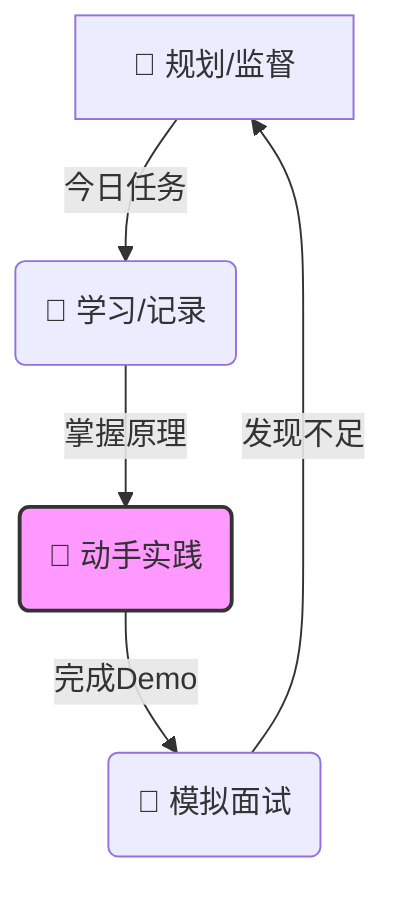

# � Learning Loop: 计算机学生成长闭环

> **核心理念**：规划 -> 学习/记录 -> 实践 -> 面试 -> (循环)
> 这是一个更加温和、稳健的成长路径，适合大多数处于学习期的学生。

---

## 🔄 五步成长闭环 (The 5-Step Cycle)

### 1. 📅 规划与监督 (Plan & Supervise) - `Page 1`
*   **痛点**：不知道学什么，三天打鱼两天晒网。
*   **解决方案**：
    *   **路线图生成**：从 "转行小白" 到 "甚至 offer" 的完整路径。
    *   **每日看板**：强制性的每日任务清单。
    *   *特性*: 系统不仅监督你“看了没”，还要监督你“懂了没”。

### 2. 📝 辅助学习与记录 (Assist & Record) - `Page 3`
*   **痛点**：遇到报错没人问，学完就忘。
*   **解决方案**：
    *   **AI 助教**：24h 在线解答疑难杂症 (利用 Library 页面的调研功能)。
    *   **自动笔记**：将零散的知识点结构化，沉淀为永久知识库。

### 3. 🔨 辅助实践 (Practice Support) - `Page 1 (Enhanced)`
*   **痛点**：只会背八股，不会写代码。
*   **解决方案**：
    *   **微项目植入**：Supervisor 在生成计划时，**必须**包含代码任务。
        *   ❌ 任务：阅读 HTTP 协议章节。
        *   ✅ 任务：**用 Python Socket 手写一个简易 HTTP Server**。
    *   **代码 Review**: (未来规划) 允许用户粘贴代码，AI 进行 Code Review。

### 4. 🎤 模拟面试 (Mock Interview) - `Page 2`
*   **痛点**：不知道考什么，一问就慌。
*   **解决方案**：
    *   **阶段性检测**：每学完一个大的章节（如“计算机网络”），必须通过一次 AI 面试才能解锁下一章。
    *   **真实场景**：压力面、深挖项目。

### 5. 🔭 岗位对齐 (Market Align) - `Page 4`
*   **痛点**：闭门造车，学的技术过时了。
*   **解决方案**：
    *   **Job Scout**: 定期去市场上看看，现在的 JD 都在要求什么，反向修正第 1 步的计划。

---

## 🛠️ 下一步开发重点 (Action Plan)

1.  **增强 Supervisor (Plan 页)**:
    *   让生成的计划更具**实战性**。不仅是 "Study"，要有 "Coding" 任务。
2.  **增强 Library (Library 页)**:
    *   允许用户把“面试中不懂的题”直接一键保存进来。
3.  **连接各模块**:
    *   Dashboard (首页) 需要展示这几个环节的整体进度。
